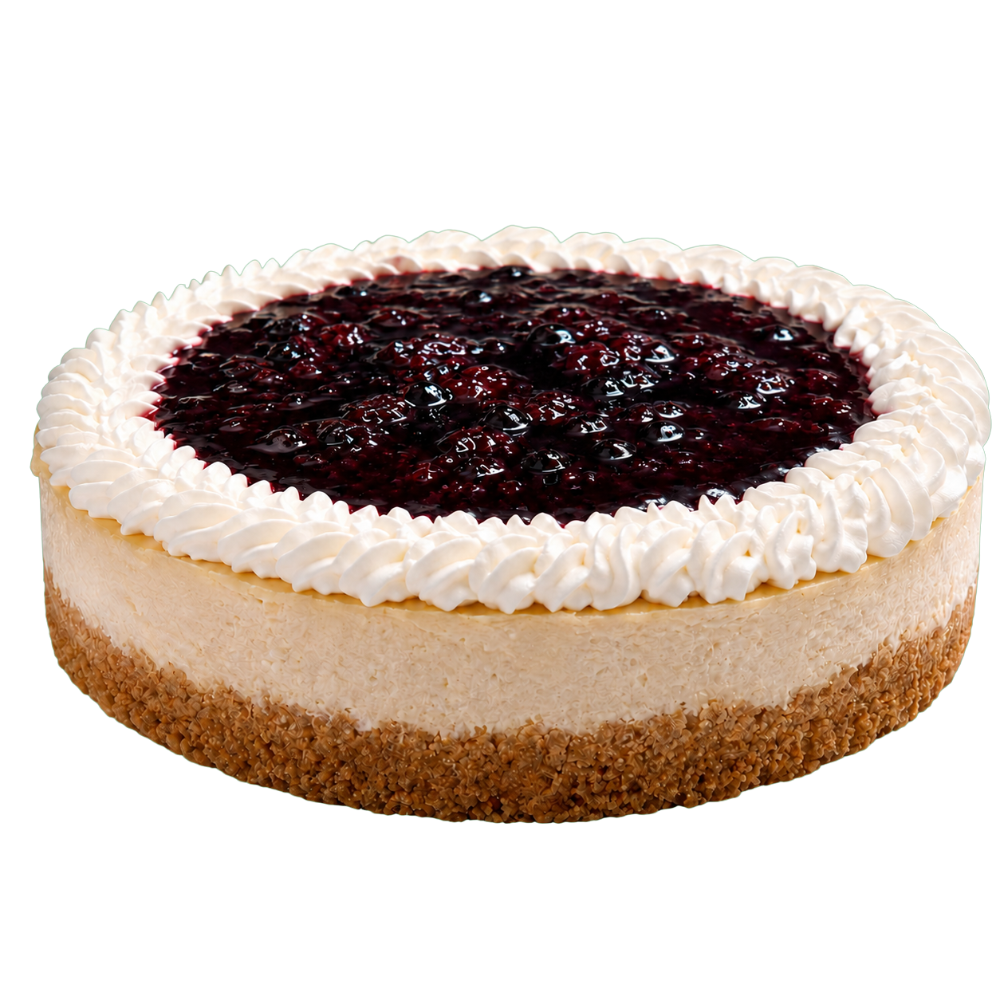

# Plan de cambios — EspiralDulceWeb

Plan por fases para alinear tu codebase (`EspiralDulceWeb/`) con el design system. Cada fase es independiente — puedes pararte después de cualquiera y el sitio sigue funcionando.

**Cómo usar este documento en Claude Code:**
> Léete `CAMBIOS.md` y empecemos por la **Fase 1**. Aplica todos los cambios listados, valida que el sitio compile y abre el index para que lo vea.

---

## Fase 1 — Quick wins (15 min)

Cambios obvios, una línea cada uno, cero riesgo.

### 1.1 Espacio del CTA en el nav
Está demasiado pegado a "Contacto".

**`css/styles.css`** — buscar `.nav-cta`:
```css
/* antes */
.nav-cta { margin-left: 1rem; }

/* después */
.nav-cta { margin-left: 2rem; }
```

### 1.2 Corregir el alt-text del hero
La imagen es un **cheesecake de zarzamora**, no un panque de zanahoria.

**`index.html`** — buscar la sección hero, en `.hero-image`:
```html
<!-- antes -->


<!-- después -->

```

### 1.3 Unificar el número de WhatsApp
Hay **dos números** en el código:
- `5610003837` — el real (en CTAs visibles + flotante)
- `5512345678` — placeholder de prueba (dentro de `js/script.js`)

Decisión: usar el real en todos lados. Si quieres mantener uno aparte para "ver detalles" desde JS, dilo y lo dejamos explícito.

**`js/script.js`** — función `openWhatsApp`:
```js
// antes
window.open(
  `https://wa.me/5215512345678?text=${encodedMsg}`,
  '_blank',
  'noopener,noreferrer'
);

// después
window.open(
  `https://wa.me/525610003837?text=${encodedMsg}`,
  '_blank',
  'noopener,noreferrer'
);
```

### 1.4 Actualizar `CLAUDE.md`
Está desactualizado — menciona "Mi Pastelería Deliciosa" e imágenes de Unsplash que ya no se usan.

**`CLAUDE.md`** — reemplazar el bloque "Project Overview":
```md
## Project Overview

**EspiralDulceWeb** is a static, single-page marketing site for **Espiral Dulce**, an
artisanal pastry studio based in Anzures, Miguel Hidalgo (CDMX). It sells pasteles,
galletas, panques, tartas y postres a pedido — la venta es por WhatsApp y la entrega
es a domicilio en toda la CDMX. No tienda física, no checkout online.

Plain HTML/CSS/JS — no build system, bundler, or framework. Open `index.html`
directly or serve via any static file server.
```

Y borra la sección "Images are sourced from Unsplash…" — ya no aplica, todas las imágenes están en `images/`.

---

## Fase 2 — Limpiar nombres de tokens CSS (30 min)

Los nombres actuales son engañosos: `--pink` no es rosa (es ámbar/cobre), `--gold` es marrón. Renombrar mejora muchísimo la mantenibilidad sin cambiar nada visual.

### 2.1 Agregar aliases semánticos
**`css/styles.css`** — al inicio del bloque `:root`, debajo del comentario `/* Colores */`, agregar:

```css
:root {
  /* === Aliases nuevos (úsalos para todo lo nuevo) === */
  --amber:        #C87941;   /* color de acción principal */
  --amber-light:  #D4956B;
  --amber-soft:   #E8B87A;
  --cocoa:        #8B4513;   /* marrón sello */
  --cocoa-light:  #6B3A1F;
  --ink:          #3D2314;
  --ink-2:        #2A1709;
  --cream:        #F5ECD7;
  --cream-soft:   #F9F0E3;

  /* === Variables legacy (existentes) — mantener para compatibilidad === */
  --pink:        var(--amber);
  --pink-light:  var(--amber-light);
  --pink-dark:   var(--cocoa);
  --gold:        var(--cocoa);
  --gold-light:  var(--amber);
  --dark:        var(--ink);
  --dark-2:      var(--ink-2);
  --mid:         var(--cocoa-light);
  --muted:       #A07855;
  --light-bg:    var(--cream);
  --white:       #FFFFFF;

  /* ... resto del :root (--radius, --shadow, etc) sin cambios ... */
}
```

> Esto **no rompe nada** porque las variables viejas siguen existiendo, ahora apuntan a los nombres nuevos. Puedes ir migrando archivos a los nombres nuevos uno por uno sin prisa.

### 2.2 (Opcional) Migrar referencias en bloques
Si quieres limpiar de una vez, busca y reemplaza en `css/styles.css` y `css/portafolio.css`:

| Buscar | Reemplazar por |
|---|---|
| `var(--pink)` | `var(--amber)` |
| `var(--pink-dark)` | `var(--cocoa)` |
| `var(--gold-light)` | `var(--amber)` |
| `var(--dark-2)` | `var(--ink-2)` |
| `var(--dark)` | `var(--ink)` |
| `var(--light-bg)` | `var(--cream)` |

Después puedes borrar las variables legacy. **No** lo hagas si no vas a hacer todos los reemplazos.

---

## Fase 3 — Iconografía (45 min)

El emoji nativo se ve mal en Windows/Android. Reemplazar `📞 💡 🚚 ✉️ 📍` con SVGs limpios.

### 3.1 Cargar Lucide vía CDN
**`index.html`** — antes del `</body>`, junto al script propio:
```html
<script src="https://unpkg.com/lucide@latest"></script>
<script>lucide.createIcons();</script>
```

(Y lo mismo en `portafolio.html` y `visualizador-pastel.html` si usas los íconos ahí.)

### 3.2 Reemplazar emojis en el "Proceso"
**`index.html`** — sección `#proceso`, los tres `.paso-icon`:

```html
<!-- antes -->
<div class="paso-icon">📞</div>
<div class="paso-icon">💡</div>
<div class="paso-icon">🚚</div>

<!-- después -->
<div class="paso-icon"><i data-lucide="message-circle"></i></div>
<div class="paso-icon"><i data-lucide="lightbulb"></i></div>
<div class="paso-icon"><i data-lucide="truck"></i></div>
```

Y en `css/styles.css`, ajustar `.paso-icon` para que el SVG se vea bien:
```css
.paso-icon {
  font-size: 1.6rem;
  margin-bottom: 0.5rem;
  color: var(--cocoa);
  display: flex;
  justify-content: center;
}
.paso-icon svg { width: 28px; height: 28px; }
```

### 3.3 Reemplazar emojis en contacto
**`index.html`** — sección `#contacto`:
```html
<!-- antes -->
<div class="contact-card-icon icon-email" aria-hidden="true">✉️</div>
<div class="contact-card-icon icon-location" aria-hidden="true">📍</div>

<!-- después -->
<div class="contact-card-icon icon-email" aria-hidden="true">
  <i data-lucide="mail"></i>
</div>
<div class="contact-card-icon icon-location" aria-hidden="true">
  <i data-lucide="map-pin"></i>
</div>
```

CSS para que el SVG llene el círculo:
```css
.contact-card-icon svg { width: 26px; height: 26px; }
```

(El WhatsApp SVG inline ya está bien — no tocar.)

---

## Fase 4 — Pulido (1 hora)

### 4.1 Botón "Diseña tu pastel" — clase real, no inline-style
**`index.html`**, en el CTA principal:
```html
<!-- antes -->
<a href="visualizador-pastel.html" class="btn btn-lg"
   style="background:rgba(255,255,255,0.15);color:#fff;border:2px solid rgba(255,255,255,0.4);">
  Diseña tu pastel →
</a>

<!-- después -->
<a href="visualizador-pastel.html" class="btn btn-lg btn-ghost-dark">
  Diseña tu pastel →
</a>
```

**`css/styles.css`**, agregar a la sección "Botones":
```css
.btn-ghost-dark {
  background: rgba(255, 255, 255, 0.15);
  color: var(--white);
  border: 2px solid rgba(255, 255, 255, 0.4);
}
.btn-ghost-dark:hover {
  background: rgba(255, 255, 255, 0.25);
  border-color: var(--white);
  transform: translateY(-2px);
}
```

### 4.2 Footer social — quitar o reemplazar
Los chips `f`, `ig`, `in` con `href="#"` no llevan a ningún lado. Opciones:
- **A** — quitarlos hasta que tengas redes activas
- **B** — agregar links reales y reemplazar texto con SVGs (Lucide: `facebook`, `instagram`, `linkedin`)

**`index.html`**, opción B:
```html
<div class="footer-social" aria-label="Redes sociales">
  <a href="https://www.instagram.com/espiraldulce" aria-label="Instagram" target="_blank" rel="noopener">
    <i data-lucide="instagram"></i>
  </a>
  <a href="https://www.facebook.com/espiraldulce" aria-label="Facebook" target="_blank" rel="noopener">
    <i data-lucide="facebook"></i>
  </a>
</div>
```

(LinkedIn rara vez aplica para una repostería — recomendaría quitarlo.)

### 4.3 Lazy-load consistente
Verificar que **todas** las imágenes que no son above-the-fold tengan `loading="lazy"`. La del hero queda `loading="eager"`; el resto debería ser `lazy`. Ya lo está en la mayoría — solo revisar las tarjetas de testimonios y servicios.

### 4.4 `scrollIntoView` en formulario
**`js/script.js`** línea ~244 — el sistema prefiere métodos DOM más controlables:
```js
// antes
formSuccess.scrollIntoView({ behavior: 'smooth', block: 'nearest' });

// después
const rect = formSuccess.getBoundingClientRect();
window.scrollBy({ top: rect.top - 100, behavior: 'smooth' });
```

(No es crítico — `scrollIntoView` funciona, pero el método nuevo es más predecible.)

---

## Fase 5 — Estructura de datos (opcional, 1-2 horas)

Hoy los productos están hardcodeados como HTML repetido en `index.html` + `portafolio.html`. Si quieres iterar más rápido, extrae a JSON.

### 5.1 Crear `data/productos.json`
Estructura sugerida (ya tengo el shape definido en el design system, `ui_kits/website/data.jsx`):

```json
[
  {
    "id": "panque-zanahoria",
    "nombre": "Panque de Zanahoria",
    "categoria": "Panes y Panques",
    "cat": "panques",
    "desc": "Tierno, húmedo y lleno de sabor natural.",
    "ingredientes": ["Harina de trigo", "Zanahoria rallada", "..."],
    "img": "images/portafolio/panque_zanahoria_sin_fondo.png"
  }
]
```

### 5.2 Renderizar las flip-cards desde JS
En `js/portafolio.js` (o nuevo `js/render-cards.js`), un loop que toma el JSON y genera el HTML de cada `.flip-card`. Esto te ahorra **mucha** duplicación (hoy son ~50 líneas por tarjeta × 24 productos).

Ventaja: agregar un producto = 1 entrada en JSON, no copy-paste de 50 líneas.

> Este cambio sí toca arquitectura — pídelo cuando estés listo y te paso el código completo del renderer.

---

## Fase 6 — Cosas más grandes (cuando tengas tiempo)

Estos son cambios que **no son urgentes** pero mejoran mucho el proyecto. No los empieces sin platicar primero.

- **Página de detalle de producto** (slug por producto, no solo flip-card)
- **Formulario que sí envíe** (hoy solo guarda en `localStorage`) — Formspree, Netlify Forms o Resend
- **Schema.org markup** para SEO local (LocalBusiness, Bakery, AggregateRating)
- **Open Graph image** real (hoy no hay `<meta property="og:image">`)
- **Manifest + favicon** completos
- **`sitemap.xml` + `robots.txt`**
- **Analytics** (Plausible o Umami — privacy-friendly, no Google Analytics)

---

## Orden recomendado

1. **Fase 1** ahora (15 min, cero riesgo)
2. **Fase 3** después (45 min, mejora visual en Windows/Android)
3. **Fase 2** cuando tengas un rato (limpieza interna, no se nota afuera)
4. **Fase 4** picotear cuando te encuentres con cada cosa
5. **Fases 5-6** solo si vas a invertir tiempo serio

Cuando termines cada fase, abre `index.html` y `portafolio.html` y haz un walk-through rápido (desktop + mobile en DevTools). Si algo se ve raro, pégame el screenshot acá y lo diagnosticamos.
